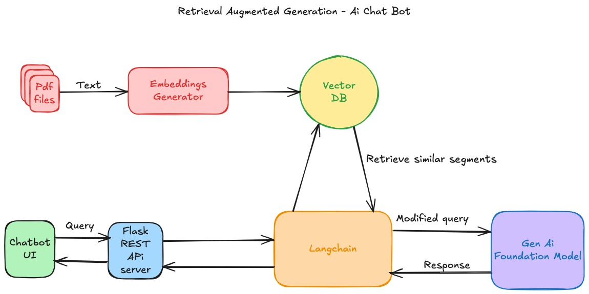

# Configurable Chatbot AI

An easily customizable AI chatbot.

## High Level Design



## Requirements

- Model embedding: `amazon.titan-embed-text-v1` for embeddings generation  
- Model foundation: `amazon.titan-embed-text-v1`  

## Getting Started

**RAG Architecture**

### Step 0: AWS Access

1. Request access to embedding and foundation models thro AWS Web UI.
2. Generate Access and Secret Keys and store in credentials file. 

### Step 1: Create Development Environment

1. [Install Anaconda Platform](https://www.anaconda.com/download)  
2. Create new environment with python 3.11.11 
3. Activate env and install dependencies : pip install -r requirements.txt
4. conda install -c conda-forge nodejs=14.2.0
5. npm install react react-dom

### Step 2: Setup Local DB and Optional PDF Data  

1. **Prerequisites:** Docker engine  
2. **Setup Qdrant Vector DB:**  
   ```sh
   cd /docker/qdrant
   docker-compose up -d
   ```
   Access Qdrant UI: [http://localhost:6333/dashboard](http://localhost:6333/dashboard)  


### Step 3: (Optional) Convert private pdf to embeddings and store in db 

3. **Optional: PDF to Vector DB Embeddings Generator:**  
   - Directory: `/tools`  
   - Run:  
     ```sh
     python pdf_embeddings_generator.py
     ```
   - Default configs:  
     ```yaml
   
     ```
   - Test similarity search : run : python test_similarity_search_vector_db.py
   -  Provide input query thro command line

### Step 4: Run Application Components  
 ###### Under development #############

  Directory: `/server`
1. **Server:** Flask server that calls the underlying Langchain module  
   ```sh
   python server/app_server.py
   ```
2. **UI:** React and Node.js-based simple chat window  
npm install react react-dom bootstrap

   npm install
   npm start
3. **Langchain Module:** In progress  

